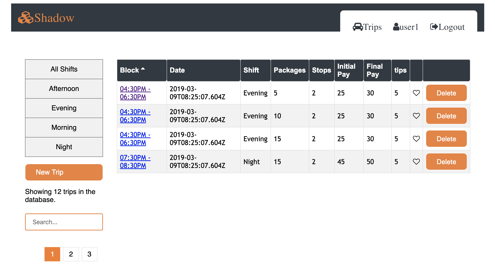

# [Shadow](https://road-rate-client.herokuapp.com/)

  

Shadow is web application service that help Amazon drivers track their trips. 

## Why Shadow?

**Thousands of Amazon drivers are unable to view their past/ historical trips, but more importantly they are unable to tell how much exactly they made before and after tips, how much stops they made**

## What is Shadow?

Shadow is web application service that help Amazon drivers to track their trips.

- STORE AND VIEW THEIR HISTORICAL DATA
- CALCULATE TIPS AUTOMATICALLY
- SEARCH, ADD, DELETE, UPDATE AND SORT THEIR TRIPS

## Heroku Live App

- [Deployed Client](https://limitless-beach-69771.herokuapp.com)
- [Deployed Server](https://peaceful-meadow-82701.herokuapp.com/)
- [Client Repo](https://github.com/mohawow/shadow)
- [Server Repo](https://github.com/mohawow/shadow-api-node)

**All Users:**

- Landing page with background info and login/registration navbar.
- User Registration and Login forms are /Auth/ using jwt authToken and Joi validation.

**Demo User:**

- DEMO USERNAME: user1@domain.com
- PASSWORD: user1

**Trip Data Means:**
[Date, time, shift, number of packages, number of Stops, initial pay, final pay, tips ]

## App Features

**Registered Users:**

- Registered users can "add" all trips data.
- Registered users can "view" all trips data.
- Registered users can "delete" all trips data.
- Registered users can "update" all trips data.
- Registered users can "sort" by columns in trips data.
- Registered users can "search" by word for a trips data.
- Registered users can "select" filter by shift.
- Registered users can "favor" certain row.
- Registered users can use pagination feature when they reach 4 rows per page to view more trips.
- Registered users can view their automatically calculated tips.

**V2 future Plans**

- Log time automatically upon login.
- Calculate Mileage upon login to app and log out.
- Chart report that shows meaning visual data ex. Chart.js
- Community forums.

## Full-Stack

**Front End:**

- Create React App
- React
- Axios
- Joi
- JWT
- CSS: used bootstap terminologies only.
  Plan to convert CSS app to bootstap after graduation.

**Back End:**

- Node
- Express
- Axios
- Joi
- JWT
- MongoDB
- Mongoose

**Testing:**

- Jest
- Enzyme

## App Screenshots

<h2 align="center">Login Page </h2>

<h2 align="center">Registration Page </h2>

<h2 align="center">Dashboard </h2>

<h2 align="center">Adding new Trip </h2>

